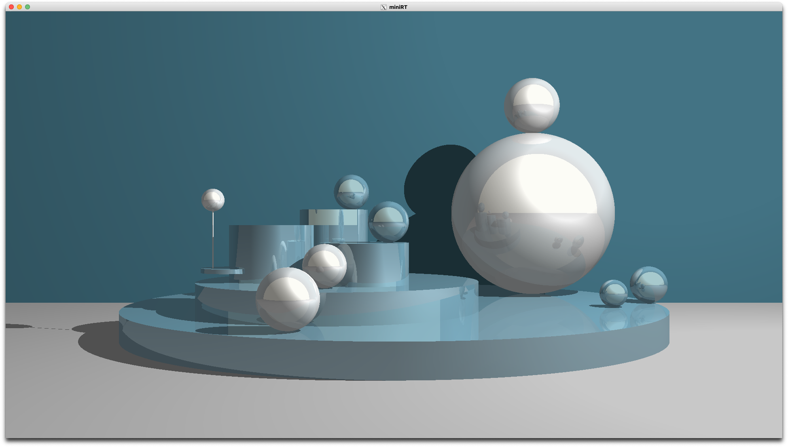
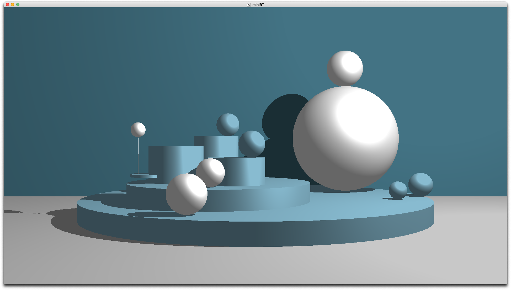
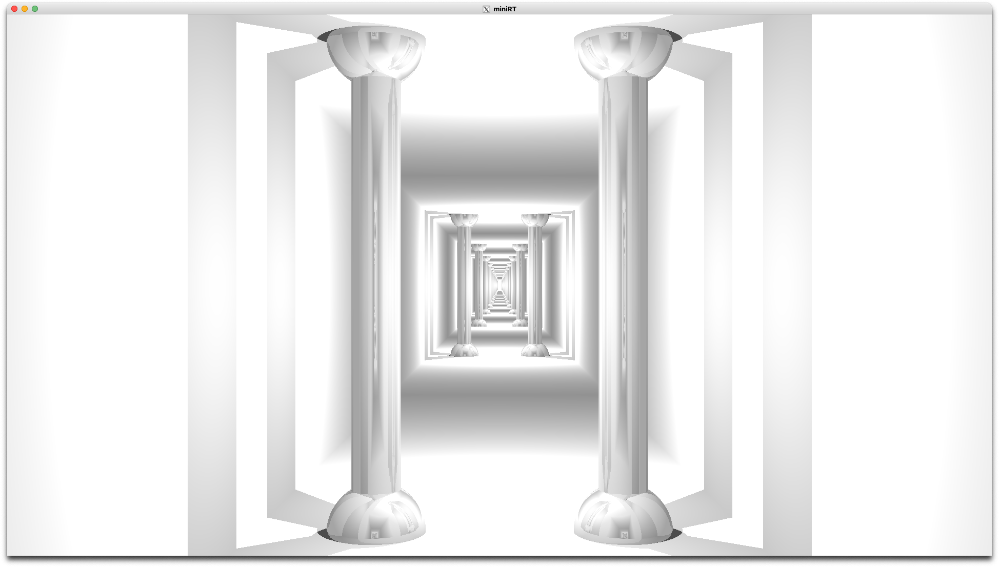
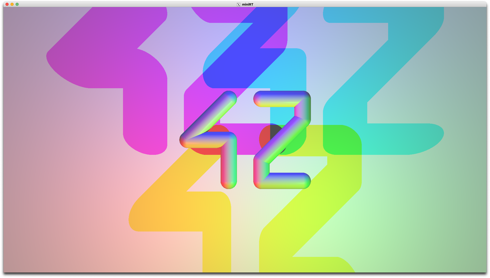

# MiniRT

|  |  |
| ------------------------------------------------------------ | ------------------------------------------------------------ |
|  |  |

### Controls

| KEY           | ACTION                                                       |
| ------------- | ------------------------------------------------------------ |
| Mouse click   | Selects the object or light pointed by mouse cursor.         |
| Mouse scroll  | Increments/Decrements the current parameter.                 |
| `C`           | Toggles camera interactions, when this flag is `ON` all interactions belongs to the camera. If the flag is `OF` interactions belongs to the selected objects/lights. [Defaults to `ON`] |
| `S`, `T`, `R` | Switches between the following interaction modes: `RESIZE (S):` - Resizes the diameter of selected spheres. - Resizes the diameter and/or height of selected cylinders. - Increments/decrements intensity of selected lights. - Zoom in/out (translates the camera in the direction pointed by the mouse cursor). - Increments/decrements camera FOV. `TRANSLATE (T):` Translates the origin of the selected objects/lights/camera along the selected axis. `ROTATE (R):` Rotates the selected objects/camera along the selected axis. [Defaults to `S`] |
| `X`, `Y`, `Z` | Selects the corresponding axis. [Defaults to `X`]       |
| `L`           | Makes spot lights visible (represented by a small white sphere), you can only select lights when they are visible. |
| `SPACE`       | Unselects all objects and lights.                            |
| `M`           | Enables/disables reflection for all objects.                 |
| `F`           | Toggles FOV flag. When this flag is active, `RESIZE` action in camera mode will modify the camera FOV value, instead of triggering a zoom/dezoom. [Defaults to `OF`] |
| `H`           | Toggles HEIGHT flag. When this flag is active, `RESIZE` action will modify the height of selected objects that have a height property. This flag is additionable with DIAMETER flag. [Defaults to `ON`] |
| `D`           | Toggles DIAMETER flag. When this flag is active, `RESIZE` action will modify the diameter of selected objects that have a diameter property. This flag is additionable with HEIGHT flag. This flag does not apply to spheres. [Defaults to `OF`] |
| `A`           | Toggles AMB_LIGHT flag. When this flag is active, interactions will only apply to the ambiant light. So if a mouse scroll event occurs, it will increment/decrement the brightness of the ambiant light. [Defaults to `OF`] |

